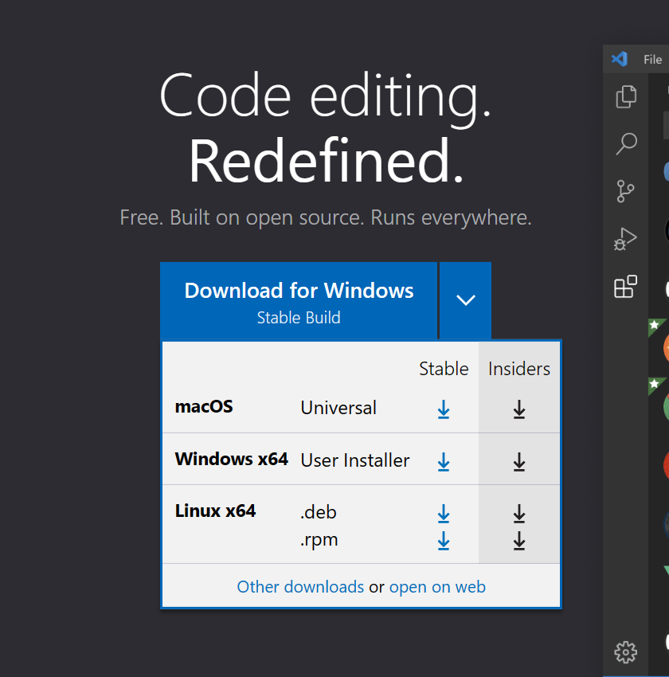
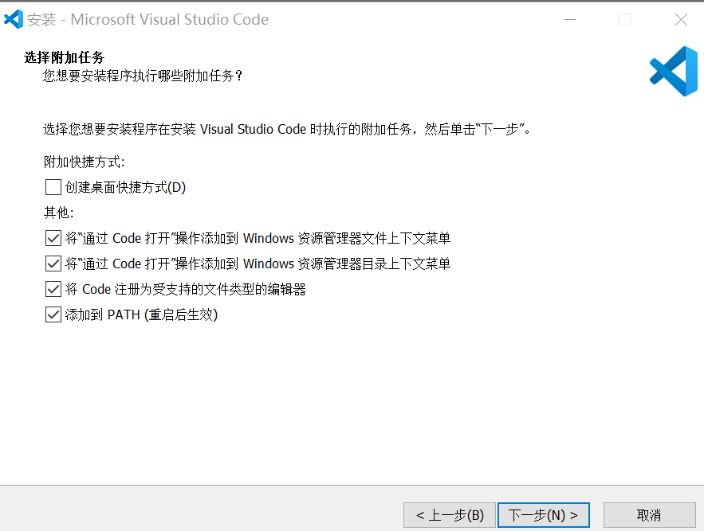
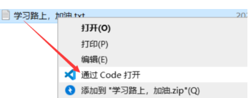
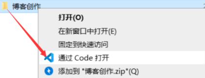

## VS code

### 1.下载

[https://code.visualstudio.com/download](https://link.zhihu.com/?target=https%3A//code.visualstudio.com/download)

1.打开官网，点击download for windows右侧箭头

2.选择Other downloads

**User Installer**版：

安装目录：C:\Users\UserName\AppData\Local\Programs\Microsoft VS Code

会安装在当前计算机帐户目录,意味着如果使用另一个帐号登陆计算机将无法使用别人安装的vscode。

**System Installer**版：

安装目录：C:\Program Files\Microsoft VS Code

安装在非用户目录,例如C盘根目录,任何帐户都可以使用。

当然你可以自定义路径，只要不是User路径就是System Installer了

* vscode默认提供的**User Installer**版

* stable稳定版，insiders测试版

3.安装

（个人喜好）

1：在桌面创建快捷方式：win10勾选，win11不勾选

2：将VSCode添加到右键菜单，支持打开文件：勾选

说明：将“通过Code打开”操作添加到 Windows 资源管理器文件上下文菜单，可以直接通过VSCode打开该文件

3：将VSCode添加到右键菜单，支持打开目录：勾选

说明：将“通过Code打开”操作添加到 Windows 资源管理器目录上下文菜单，可以直接通过VSCode打开该文件夹

4：勾选后会把很多文本格式改为用VSCode打开，例如.txt文件：勾选

说明：默认使用 VScode 打开诸如 txt,py 等文本类型的文件。

让 VScode 支持的代码文件全部变成 VScode 默认打开，文件图标也会随之更改。

5：添加到PATH（环境变量），自动添加，无需手动配置：勾选
